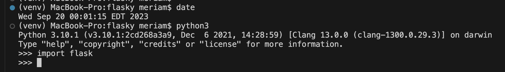
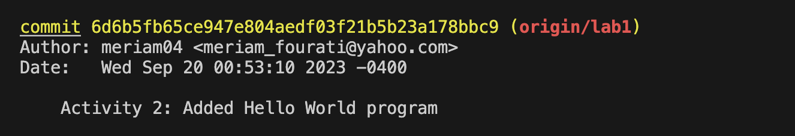
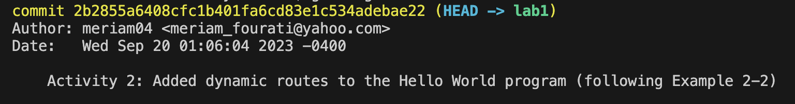
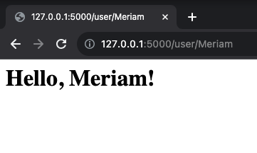
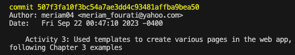
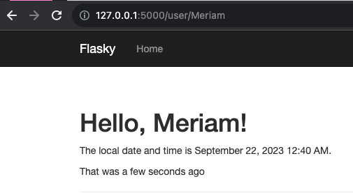

# Meriam Fourati -- Lab1: Flasky Web Development

This repo is a clone of https://github.com/miguelgrinberg/flasky 
## Activity 1
A screenshot showing that you have successfully finish the task (with a timestamp).
e.g., Activate the virtual environment in the directory created for this lab and import flask in this
virtual environment

## Activity 2
Submission:
- Two commit messages indicating you successfully reproduce example 2-1 and 2-2.
- A screenshot of your hello world html page with your name on the web page.

## Activity 3
Submission:
- A commit message indicating that you finish activity 3.
- A screenshot showing that you have successfully finish the task

